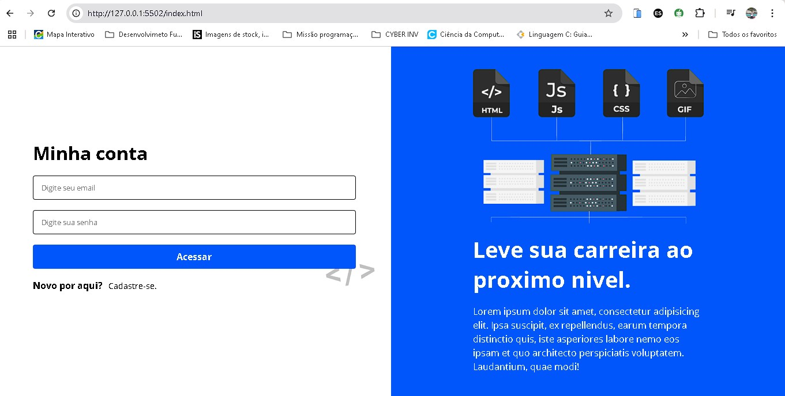

# 🔐 Tela de Login e Cadastro

Este é um projeto de **interface de autenticação** com telas de **Login e Cadastro** desenvolvidas com **HTML5** e **CSS3**, sem o uso de frameworks ou bibliotecas externas.

O objetivo é praticar a criação de interfaces modernas, limpas e responsivas focadas na experiência do usuário.

 <!-- Substitua pelo caminho ou URL de uma imagem do seu projeto -->

## 🚀 Tecnologias Utilizadas

- HTML5 semântico
- CSS3 puro
- Flexbox
- Media Queries (responsividade)

## 📸 Preview Online

Você pode visualizar o projeto online clicando aqui:  
🔗 [Acesse o Projeto](https://tela-login-psi-ivory.vercel.app/) <!-- Substitua com o link do deploy -->

## 📱 Funcionalidades

- Tela de login com campos de email e senha
- Tela de cadastro com nome, email e senha
- Layout adaptado para dispositivos móveis
- Design moderno e organizado

## 🎯 Objetivo do Projeto

Este projeto foi criado para:

- Praticar HTML5 e CSS3 sem dependências externas
- Melhorar a habilidade de montar interfaces realistas
- Trabalhar conceitos de responsividade com Flexbox
- Reforçar boas práticas de organização de código

## 🧠 Aprendizados

Durante o desenvolvimento, reforcei:

- Criação de layouts responsivos
- Posicionamento de elementos com Flexbox
- Design visual simples e profissional
- Separação clara de responsabilidades entre estrutura e estilo

## 👨‍💻 Como Usar

1. Clone o repositório:
   ```bash
   git clone https://github.com/JoaoDev20/tela-login
   cd tela-login
   ```
